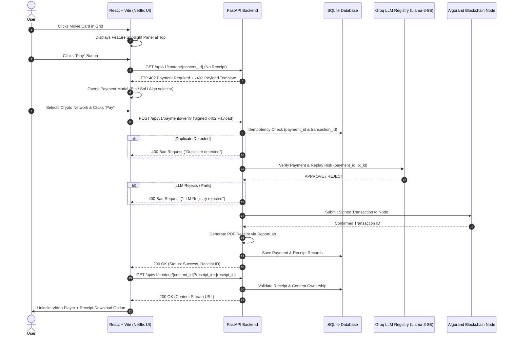

# Comprehensive Context & System Architecture Report: Non-Custodial x402 Netflix-Like Streaming Mesh

---

## 1. Executive Summary & Objective

This project implements a non-custodial **x402 Payment Verification and Settlement Mesh** integrated into a modern **Netflix-like web application**. 

The core objective is to enforce micro-payments for streaming content (movies/episodes) without relying on centralized payment processors or taking custody of user crypto funds. Access to media is protected by standard `HTTP 402 Payment Required` challenges. Upon payment initiation, signed web3 payment payloads are validated, checked against an LLM-powered anti-replay registry (Groq API using Llama 3 8B), submitted to the blockchain (Algorand Testnet/Mainnet, with multi-chain payment options simulated in the UI for ETH, SOL, and ALGO), recorded in a local SQLite database, and finalized with tamper-proof PDF receipt generation.

---

## 2. System Architecture & End-to-End Flow



---

## 3. Technology Stack & Dependencies

### Backend Stack
- **Framework:** FastAPI (Python 3.11+)
- **ASGI Server:** Uvicorn
- **Database / ORM:** SQLite + SQLAlchemy 2.0
- **Validation / Settings:** Pydantic v2 + `python-dotenv`
- **Blockchain SDK:** `py-algorand-sdk` 2.11
- **LLM Integration:** Groq Python SDK (`groq`) using `llama3-8b-8192`
- **PDF Generation:** ReportLab 5.0

### Frontend Stack
- **Framework:** React 19 + Vite 8
- **Styling:** Tailwind CSS v4 + `@tailwindcss/postcss` + PostCSS 8
- **HTTP Client:** Axios
- **UI Icons:** Lucide React
- **Typography & Theme:** Dark mode Netflix aesthetic (`#141414` canvas, `#E50914` brand red)

---

## 4. Project Directory Structure

```
netflix-x402/
├── backend/
│   ├── .env                    # Environment configuration (Keys, Networks, Port)
│   ├── .env.example            # Environment template for version control
│   ├── config.py               # Settings loader (os / python-dotenv)
│   ├── database.py             # SQLAlchemy engine & session factory
│   ├── models.py               # Database schemas (PaymentRecord, Receipt)
│   ├── schemas.py              # Pydantic schemas (X402PaymentPayload, PaymentResponse)
│   ├── main.py                 # FastAPI application, CORS, and HTTP route handlers
│   ├── sql_app.db              # SQLite database (auto-generated on launch)
│   ├── receipts/               # Storage directory for generated PDF receipts
│   └── services/
│       ├── algorand.py         # Algorand node integration & signature verification
│       ├── llm_registry.py     # Groq LLM API prompt and duplicate settlement check
│       ├── payment.py          # State machine orchestrating DB, LLM, Algo, & Receipts
│       └── receipt.py          # PDF generation service using ReportLab canvas
└── frontend/
    ├── package.json            # Node.js dependencies and scripts
    ├── vite.config.js          # Vite configuration
    ├── postcss.config.js       # PostCSS config targeting @tailwindcss/postcss
    ├── tailwind.config.js      # Tailwind CSS configuration
    └── src/
        ├── main.jsx            # React root entry point
        ├── App.jsx             # Main container, sticky header, feature spotlight & modal state
        ├── index.css           # Tailwind v4 import (@import "tailwindcss";) & global styles
        ├── services/
        │   └── api.js          # Axios API bridge to FastAPI backend
        └── components/
            ├── MovieGrid.jsx   # Movie catalog cards & click-to-select logic
            ├── PaymentModal.jsx# x402 payment modal (Ethereum, Solana, Algorand options)
            └── VideoPlayer.jsx # Video player with back navigation & PDF download button
```

---

## 5. Detailed Component Specifications

### Backend Components

#### 1. `backend/config.py`
Reads settings securely from environment variables using `python-dotenv`:
- `ALGORAND_NETWORK`: `testnet` or `mainnet` (Default: `testnet`)
- `ALGORAND_FACILITATOR_MNEMONIC`: 25-word seed phrase for recipient facilitator account
- `GROQ_API_KEY`: API key for Groq LLM query service
- `HOST` / `PORT`: Uvicorn server configuration (`0.0.0.0:8000`)

#### 2. `backend/models.py`
Defines two database entities via SQLAlchemy:
- `PaymentRecord`: `id`, `payment_id` (unique index), `transaction_id` (unique index), `amount`, `currency`, `resource_identifier`, `status` (`pending`, `succeeded`, `failed`), `timestamp`.
- `Receipt`: `id`, `receipt_id` (unique index), `payment_id`, `file_path`, `timestamp`.

#### 3. `backend/schemas.py`
Pydantic model defining the x402 payload structure:
```python
class X402PaymentPayload(BaseModel):
    payment_id: str
    transaction_id: str
    amount: float
    currency: str = "ALGO"
    scheme: str = "x402"
    network: str = "Algorand"
    recipient_address: str
    resource_identifier: str
    nonce: str
    signature: str
```

#### 4. `backend/services/algorand.py`
Interfaces with Algorand public nodes via `AlgodClient` (`https://testnet-api.algonode.cloud` or `https://mainnet-api.algonode.cloud`). Contains a test fallback: if `signature == "mock_signature"`, it returns a successful mock transaction without sending raw bytes to the node.

#### 5. `backend/services/llm_registry.py`
Constructs a strict compliance prompt for Groq LLM (`llama3-8b-8192`) passing `payment_id` and `transaction_id`. Fails closed (`return False`) if the API key is missing or an error occurs, or returns `True` if approved.

#### 6. `backend/services/receipt.py`
Generates an official PDF receipt using ReportLab, stamping it with a unique ID (`RCPT-XXXXXXXX`), ISO timestamp, Payment ID, Transaction ID, Amount, Currency, and Resource ID. Saves PDF files into `backend/receipts/`.

#### 7. `backend/services/payment.py`
State machine orchestrator:
1. **Local Idempotency Check**: Queries SQLite for pre-existing `payment_id` or `transaction_id`. Rejects duplicates immediately.
2. **LLM Registry Check**: Calls `check_duplicate_transaction()`.
3. **Pending State**: Writes record to DB with `status="pending"`.
4. **Blockchain Execution**: Submits to Algorand network via `verify_and_submit_transaction()`.
5. **Finalization**: On success, updates record to `status="succeeded"`, generates PDF receipt, creates `Receipt` DB record, and returns `receipt_id`. On failure, marks `status="failed"`.

#### 8. `backend/main.py`
API endpoints:
- `POST /api/v1/payments/verify`: Receives `X402PaymentPayload` and calls `process_payment()`.
- `GET /api/v1/content/{content_id}`: If `receipt_id` query parameter is missing or invalid, raises `HTTP 402 Payment Required` with an x402 template response. If valid, grants access by returning content stream URL.
- `GET /api/v1/receipts/{receipt_id}`: Returns the generated PDF receipt as a downloadable file via `FileResponse`.

---

### Frontend Components

#### 1. `frontend/src/App.jsx`
- Manages selected movie state (`selectedMovie`), active playing video (`activeVideo`), x402 payment template (`paymentTemplate`), and receipt ID (`currentReceipt`).
- Displays sticky top navigation ("NEXUS").
- Renders **Feature Spotlight Panel** when a movie card is clicked, showcasing high-res artwork, full synopsis, tags (genre, year, rating, duration), and a prominent **Play** button.
- Invokes `getContent(contentId)` when Play is clicked. Catches `402 Payment Required` and displays the `PaymentModal`.

#### 2. `frontend/src/components/MovieGrid.jsx`
- Displays movie cards in a responsive CSS grid.
- Clicking a card triggers `onSelect(movie)` (does not initiate payment directly; selects the movie to feature in the top panel).
- Highlights the selected card with a red border (`ring-2 ring-[#E50914]`) and a "Selected" badge.

#### 3. `frontend/src/components/PaymentModal.jsx`
- Displays the x402 payment prompt with multi-chain options:
  - **Ethereum (ETH)** — dynamically scaled price in ETH
  - **Solana (SOL)** — dynamically scaled price in SOL
  - **Algorand (ALGO)** — standard price in ALGO
- Simulates web3 wallet signing delay (1.5 seconds) and posts the signed payload to `/api/v1/payments/verify`.
- Handles success state with animated confirmation, triggering receipt retrieval and content unlocking.

#### 4. `frontend/src/components/VideoPlayer.jsx`
- Full-screen video overlay containing an HTML5 video stream (`https://www.w3schools.com/html/mov_bbb.mp4`).
- Top header includes a "Back to Browse" button and a direct "Download Receipt" link fetching the PDF from `/api/v1/receipts/{receipt_id}`.

---

## 6. Security, Compliance & Non-Custodial Principles

1. **Non-Custodial Design**: No private keys or wallet seeds are stored in source code. All signing happens client-side (or simulated client-side).
2. **Environment Variable Isolation**: Secrets are strictly parsed from `.env` (git-ignored) via `config.py`.
3. **Fail-Closed Verification**: Any ambiguity during payload verification or LLM querying results in an immediate `HTTP 400` reject.
4. **Idempotency & Replay Protection**: Double-spending is prevented at two independent layers:
   - Database unique constraint on `payment_id` and `transaction_id`.
   - LLM compliance analysis on payload parameters.
5. **Audit Trail**: Every settled transaction generates an immutable PDF receipt stored on disk and linked in SQLite.

---

## 7. How to Run & Test

### Backend
```powershell
cd backend
.\venv\Scripts\Activate.ps1
uvicorn main:app --host 0.0.0.0 --port 8000 --reload
```

### Frontend
```powershell
cd frontend
npm run dev
```

---

## 8. Summary Prompt for External AI Systems

> **Copy-pasteable context snippet for another AI system:**
> 
> "This project is a non-custodial x402 payment verification streaming app with a Netflix-style UI. It consists of a FastAPI Python backend (SQLite + SQLAlchemy, Groq LLM registry check via Llama 3 8B, Algorand SDK, ReportLab PDF receipt generator) and a Vite + React frontend (Tailwind CSS v4, Lucide icons, Axios). Content access returns HTTP 402 Payment Required with an x402 template. The user selects a movie card to spotlight it at the top, presses Play, chooses a payment method (ETH, SOL, or ALGO) in a modal, signs the x402 payload, and submits it to `/api/v1/payments/verify`. Upon DB idempotency and LLM approval, a PDF receipt is generated, and the video stream unlocks."
