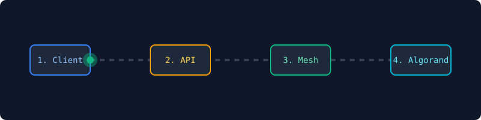

<div align="center">

<!-- Top Animated GIF -->


<h1 style="color: #facc15; font-weight: 900; letter-spacing: 2px;">NEXUS MESH</h1>
<h3><em>x402 Facilitator & Settlement Mesh for Autonomous Hardware & AI Agents</em></h3>

<!-- Badges -->
<p>
  
  
  
  
  
</p>

</div>

---

## 📌 Executive Summary

**NEXUS Mesh** is an enterprise-grade, non-custodial Verification & Settlement Mesh built to solve the machine-to-machine (M2M) micropayment problem for IoT devices and autonomous agents. 

By leveraging the HTTP `402 Payment Required` standard alongside Algorand's sub-3-second deterministic finality, NEXUS allows resource servers to securely verify and settle micro-transactions atomically without forcing every server to maintain its own complex blockchain infrastructure.

---

## 🎥 Live Settlement Topology

<div align="center">
  
  <p><sub><i>Real-time trace of the x402 challenge, Redis idempotency locking, and Algorand atomic settlement.</i></sub></p>
</div>

---

## 🏗 System Architecture & 7-Module Design

To prevent the mesh from becoming a hidden custodian or single point of failure, the infrastructure is completely decoupled into 7 distinct security modules:

1. **Compatibility Layer:** Enforces protocol versioning and rejects unsupported `(scheme, network)` pairs.
2. **Facilitator Registry:** Manages dynamic capability discovery, health checks, and circuit-breaker routing.
3. **Verification Service:** Validates Ed25519 payload signatures, exact pricing parameters, and transaction expiration windows.
4. **Settlement Service:** Controls the state machine (`RECEIVED` → `IDEMPOTENCY_CLAIMED` → `VERIFIED` → `SETTLING` → `CONFIRMED`) and confirmation tracking.
5. **Receipt Service:** Binds payments to a 0-ALGO Note field and issues verifiable off-chain HMAC-signed receipts.
6. **Observability Console:** Traces lifecycle events end-to-end, concluding with the resource-server fulfillment webhook.
7. **Extension Interface:** Provides read-only plugin hooks (such as `post_settle`) that pass core payment semantics strictly by value.

```javascript
const NEXUS_MESH_CONFIG = {
    system_version: "v2.0-beta",
    core_focus: ["x402 Payments", "Mesh Routing", "Delay Tolerant Networks"],
    technologies: {
        frontend: ["React", "Tailwind CSS"],
        backend: ["C", "Python", "FastAPI"],
        hardware: ["ESP32", "Raspberry Pi", "Arduino Nano"],
        database: ["Redis Vault", "Supabase"]
    },
    protocols: {
        wireless: ["ESP-NOW", "Connectionless Peer-to-Peer"],
        blockchain: ["Algorand AVM", "Atomic Group Transfers"]
    }
};
